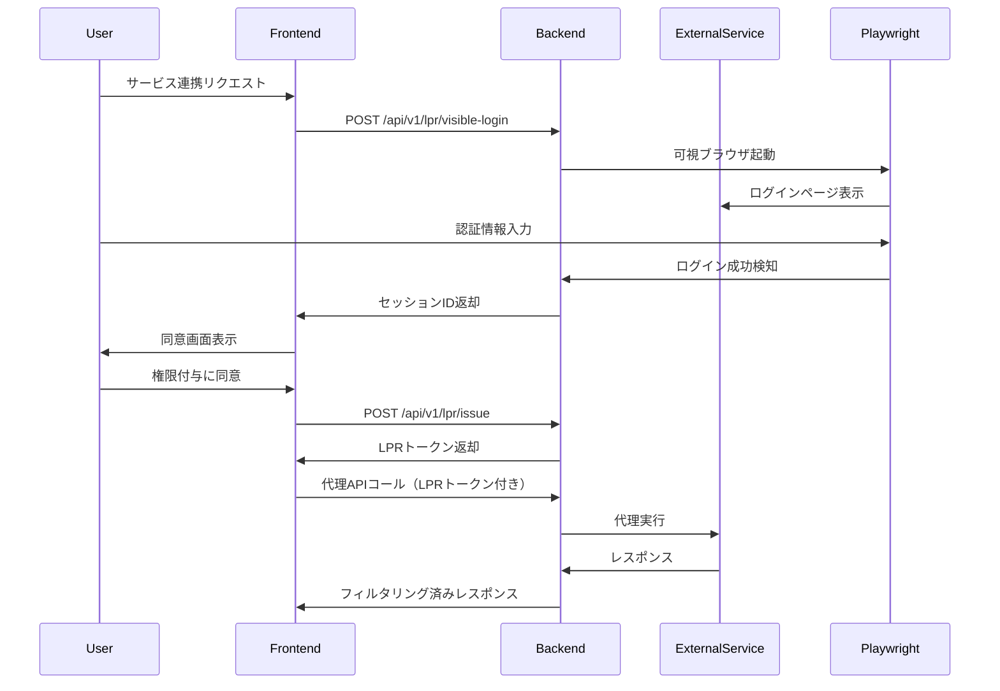

# LPR (Limited Proxy Rights) システム ドキュメント

## 概要

LPR（Limited Proxy Rights）システムは、ユーザーの代理として外部サービスにアクセスする際の安全性を確保するための包括的なセキュリティフレームワークです。

## アーキテクチャ

### 核心思想

1. **初回認証 → LPR発行 → 限定代行**
   - ユーザーが可視ブラウザで直接ログイン
   - 成功を検知してLPRトークンを発行
   - トークンを使用して限定的な代理アクセス

2. **多層防御（5層）**
   - Layer 1: LPRトークン検証
   - Layer 2: デバイス拘束
   - Layer 3: スコープ/ポリシーエンジン
   - Layer 4: レート制限/ヒューマンスピード
   - Layer 5: 監査ログ/改竄耐性

3. **セキュリティ5原則**
   - 最小権限の原則
   - ゼロトラスト
   - 多層防御
   - 監査性
   - データ最小化

## コンポーネント構成

### バックエンド

```
backend/src/
├── services/
│   ├── auth/
│   │   ├── lpr.py              # LPRトークン管理
│   │   └── visible_login.py    # 可視ログイン検知
│   └── audit/
│       └── audit_logger.py     # 監査ログシステム
├── middleware/
│   └── lpr_enforcer.py        # LPRエンフォーサー
├── api/v1/
│   └── lpr.py                  # LPR APIエンドポイント
├── models/
│   └── lpr_models.py          # データベースモデル
└── main.py                     # アプリケーション統合
```

### フロントエンド

```
frontend/src/features/lpr/
└── LPRConsent.tsx             # 同意UI
```

### データベース

```
alembic/versions/
└── 001_create_lpr_tables.py   # マイグレーション
```

## API仕様

### LPRトークン発行フロー



### エンドポイント一覧

#### 1. 可視ログイン開始
```http
POST /api/v1/lpr/visible-login
Content-Type: application/json
Authorization: Bearer {user_token}

{
  "service_name": "Shopify",
  "login_url": "https://accounts.shopify.com/login",
  "timeout": 120,
  "custom_rules": [...]
}
```

#### 2. LPRトークン発行
```http
POST /api/v1/lpr/issue
Content-Type: application/json
Authorization: Bearer {user_token}

{
  "session_id": "xxx",
  "scopes": [
    {
      "method": "GET",
      "url_pattern": "https://api.shopify.com/orders/*",
      "description": "注文情報の取得"
    }
  ],
  "origins": ["https://app.example.com"],
  "ttl_seconds": 3600,
  "policy": {
    "rate_limit_rps": 1.0,
    "require_device_match": true
  },
  "device_fingerprint": {...},
  "purpose": "注文管理",
  "consent": true
}
```

#### 3. LPRトークン検証
```http
POST /api/v1/lpr/verify
Content-Type: application/json

{
  "token": "eyJ...",
  "request_method": "GET",
  "request_url": "https://api.shopify.com/orders/123",
  "request_origin": "https://app.example.com",
  "device_fingerprint": {...}
}
```

#### 4. LPRトークン失効
```http
POST /api/v1/lpr/revoke
Content-Type: application/json
Authorization: Bearer {user_token}

{
  "jti": "token_id_xxx",
  "reason": "ユーザーによる取り消し"
}
```

#### 5. ステータス確認
```http
GET /api/v1/lpr/status/{jti}
Authorization: Bearer {user_token}
```

## セキュリティ機能

### 1. デバイス指紋

収集する情報：
- User-Agent
- 言語設定
- 画面解像度
- タイムゾーン
- プラットフォーム
- Canvas fingerprint
- WebGL fingerprint

### 2. スコープ定義

```json
{
  "method": "GET|POST|PUT|DELETE",
  "url_pattern": "https://api.example.com/path/*",
  "description": "操作の説明"
}
```

### 3. ポリシー設定

```json
{
  "rate_limit_rps": 1.0,
  "rate_limit_burst": 10,
  "human_speed_jitter": true,
  "require_device_match": true,
  "allow_concurrent": false,
  "max_request_size": 10485760
}
```

### 4. 監査ログ

記録される情報：
- 5W1H（誰が、いつ、何を、どこで、なぜ、どのように）
- イベントタイプ
- 重要度
- 相関ID
- ハッシュチェーン
- デジタル署名

## 運用ガイド

### 環境変数

```env
# LPR設定
LPR_ENABLED=true
LPR_DEFAULT_TTL=3600
LPR_MAX_TTL=86400
LPR_MIN_TTL=300

# Playwright設定
PLAYWRIGHT_HEADLESS=false
PLAYWRIGHT_TIMEOUT=120

# セキュリティ設定
LPR_SIGNING_KEY=<base64_encoded_key>
LPR_ENCRYPTION_KEY=<base64_encoded_key>

# Redis設定
REDIS_URL=redis://localhost:6379
REDIS_TTL=86400

# 監査設定
AUDIT_LOG_RETENTION_DAYS=90
AUDIT_LOG_LEVEL=INFO
```

### 初期セットアップ

```bash
# 依存関係のインストール
cd backend
pip install -r requirements.txt

# Playwrightのセットアップ
playwright install chromium

# データベースマイグレーション
alembic upgrade head

# Redis起動
docker run -d -p 6379:6379 redis:7-alpine

# サーバー起動
python src/main.py
```

### 監視項目

1. **メトリクス**
   - LPRトークン発行数
   - 検証成功/失敗率
   - 失効数
   - レート制限違反数

2. **アラート条件**
   - 異常な失効率
   - デバイス不一致の増加
   - 監査ログ書き込み失敗

3. **ログレベル**
   - INFO: 通常の操作
   - WARNING: セキュリティイベント
   - ERROR: システムエラー
   - CRITICAL: 重大なセキュリティ違反

## トラブルシューティング

### よくある問題

#### 1. Playwright起動エラー
```
Error: Failed to launch browser
```
**解決策**: 
- Chromiumがインストールされているか確認
- `playwright install chromium`を実行

#### 2. Redis接続エラー
```
Error: Redis connection failed
```
**解決策**:
- Redisサービスが起動しているか確認
- 接続URLが正しいか確認

#### 3. トークン検証失敗
```
Error: Token verification failed
```
**解決策**:
- トークンの有効期限を確認
- デバイス指紋が一致するか確認
- スコープが適切か確認

## セキュリティベストプラクティス

1. **最小権限の付与**
   - 必要最小限のスコープのみを要求
   - 短い有効期限を設定

2. **定期的な監査**
   - 監査ログの定期レビュー
   - 異常パターンの検出

3. **即座の失効**
   - 不審なアクティビティ検出時の自動失効
   - ユーザーによる手動失効の提供

4. **暗号化**
   - トークンの署名検証
   - 通信の暗号化（HTTPS）

5. **レート制限**
   - 人間的な操作速度の維持
   - バースト制限の適用

## パフォーマンス最適化

1. **キャッシング**
   - トークン検証結果のキャッシュ
   - デバイス指紋のキャッシュ

2. **非同期処理**
   - 監査ログの非同期書き込み
   - バックグラウンドでの失効チェック

3. **接続プーリング**
   - Redis接続プール
   - データベース接続プール

## 今後の拡張計画

1. **機能拡張**
   - OAuth 2.0統合
   - WebAuthn対応
   - マルチファクタ認証

2. **セキュリティ強化**
   - HSM/TPM統合
   - ゼロ知識証明
   - 量子耐性暗号

3. **運用改善**
   - 自動スケーリング
   - 分散トレーシング
   - AI異常検知

## ライセンス

MIT License

## サポート

問題や質問がある場合は、GitHubのIssueを作成してください。

---

最終更新: 2024年
バージョン: 1.0.0